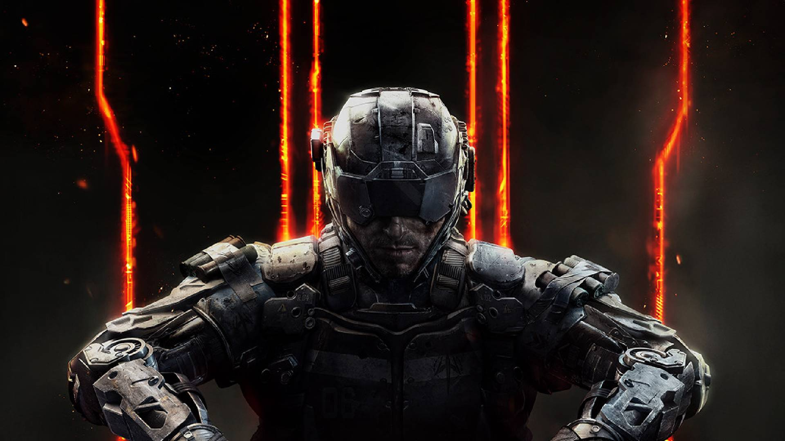

# T7-Scripts

## What is this?

This is a collection of Call of Duty Black Ops III (T7/BO3) scripts I created, written in [GSC](https://plutonium.pw/docs/modding/gsc/).  
I decided to start polishing and sharing some of my scripts to help other modders implement features into their map since some scripts/features are hard to find online or are not really good scripts mainly due to how old they are.

Huge thanks to everyone who helped me learn GSC originally for other CODs: Birchy, DoktorSAS, FutureRave among others.  
Also a massive thanks to everyone that made me learn a ton of things on BO3: serious, Rayjiun, Vertasea, Shidouri, Scworppy among others.  
And last thanks to the [Black Ops 3 Mod Tools](https://discord.com/invite/black-ops-3-mod-tools-230615005194616834) and the [DEVRAW](https://discord.com/invite/6d9swZmKpa) Discord servers and their community for helping me learn all the time!

## How do I download a script?

You can click on the files and click on then download button which should be `Download raw file`

Alternatively, you can download this entire repository to make drag and dropping several files easier.  
Just keep in mind that this downloads a copy of this repository at the moment you download it.  
If a script is updated after you downloaded this repository and you want the new version then you will need to download this repository again or a copy of the script.  

- [Download this repository](https://github.com/Resxt/T7-Scripts/archive/refs/heads/master.zip)
- Open the downloaded ZIP file
- Drag and drop the file(s) you want in the folder they need to be placed in.  

The instructions to install and use these scripts are on their respective page on this repository

As always when you use a script, asset or anything that's not yours, don't forget to credit the people that made it

## Tools recommendations

To edit scripts (and to write your own) I recommend using proper tools (software, websites and extensions/addons) to make things easier and to have more knowledge available to you as well!
The very basic of it is installing a programming editor and an extension/addon to get a proper GSC editing setup with colors, syntax and autocompletion instead of using a notepad that's unaware of how to color things and cannot provide any autocompletion as well

- An [IDE](https://en.wikipedia.org/wiki/Integrated_development_environment) (developement tool) such as [Visual Studio Code](https://code.visualstudio.com/)
- An extension to get [syntax highlighting/colored syntax](https://en.wikipedia.org/wiki/Syntax_highlighting) and [autocompletion](https://code.visualstudio.com/docs/editor/intellisense) such as [serious GSC extension for Visual Studio Code](https://marketplace.visualstudio.com/items?itemName=shiversoftdev.vscode-txgsc)
- (optional) a website listing functions API such as [scripts.zeroy.com/](https://scripts.zeroy.com/) or [gscode.net/library](https://gscode.net/library)
- (optional) Visual Studio Code extension: [Indent Rainbow](https://marketplace.visualstudio.com/items?itemName=oderwat.indent-rainbow)
- (optional) Visual Studio Code extension: [LocalizedStrings](https://marketplace.visualstudio.com/items?itemName=ApexModder.localizedstrings)
- (advanced) [the game's source code dump](https://github.com/shiversoftdev/t7-source), to see how certain things are and search for keywords to grasp information or code here and there.  
Note that you can also look at the files in your BO3 folder `share\raw\scripts`, or even better, directly import that folder into your Visual Studio Code's workspace to make searching in the entire folder easier

I highly recommend joining both of the Discord servers listed at the top of this README to get help with scripting if you're learning.  
You can also ping me there if you're in need of help with one of my script.  
